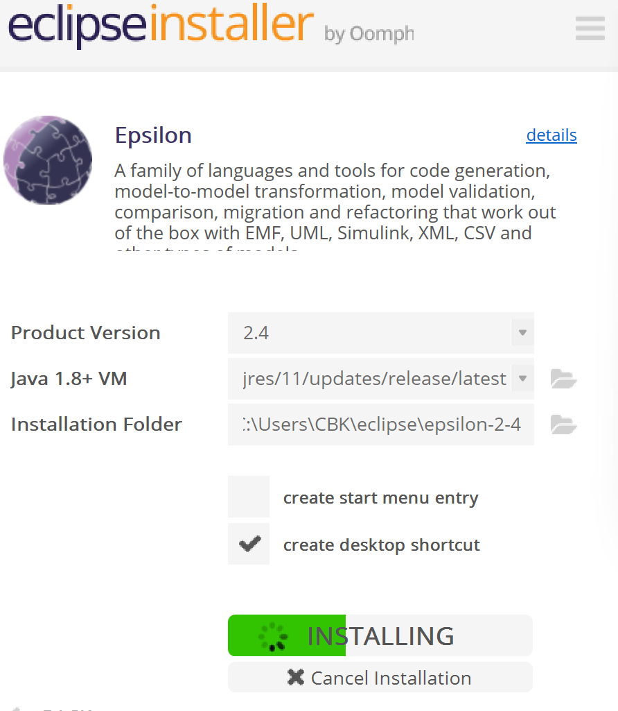
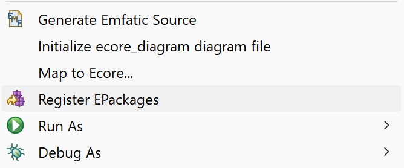
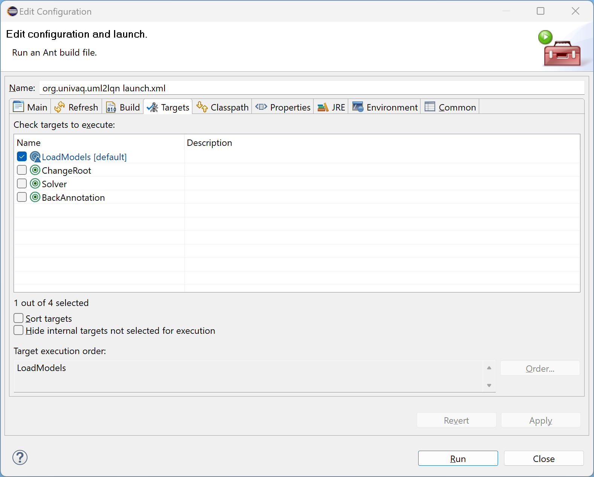

# Development Information

This section will comprise information on how to use the repository in your work.
This includes on how to set up a working environment and what branches exist.
It is strongly advised to watch the seminar of Dimitris Kolovos, that is referenced in [Epsilon](Epsilon.md).

## Setup Environment
Epsilon is integrated in Eclipse therefore this tutorial describes how to set up the resprective eclipse environment, 
the required plugins and how to run the project in Eclipse.

* Clone the project from github.
* Checkout the branch `support-workflow`
* Install the LQN-Solver by installing the project https://github.com/layeredqueuing/V5
* Download and install Eclipse Epsilon as describes here: https://eclipse.dev/epsilon/download/ \

* Import the project using `File > Import... > General > Existing Project into Workspace` and then choose the location of the git repository.
* Open the folder `lqnxsd` right klick on `lqn.ecore` and select `Register EPackages`\

* For the run to work there are more packages required. Go to `Help` > `Install New Software...` and install the following packages in the given order:
  * https://download.eclipse.org/releases/luna/ (only the `Modelling` bulletpoint is required)
  * http://download.eclipse.org/modeling/mdt/papyrus/updates/releases/neon
  * http://dice-project.github.io/DICE-Profiles/updates
* Right klick on the `launch.xml` (this is the ANT file that executes the workflow) and choose `Run As > Ant Build ... ` and the ANT configuration Dialog will open.

  * Select the `BackAnnotation` target instead of `LoadModels` 
  * Go to the `JRE` tab and configure the JRE to use the `Run in the same JRE as the workspace`
  * The `launch.xml` has three variables `input` `name` and `output`, provide them by opening the `Main` tab and entering them in the textarea `Arguments` `-Dinput=models -Dname=sample -Doutput=output`
  * Klick on `Run`
  * If everything works correctly the Build will execute successfully.

## Branches
This section will give a short overview of the branches that are present in this repository and their purpose.

### Master

### Support-Workflow

### Easier
